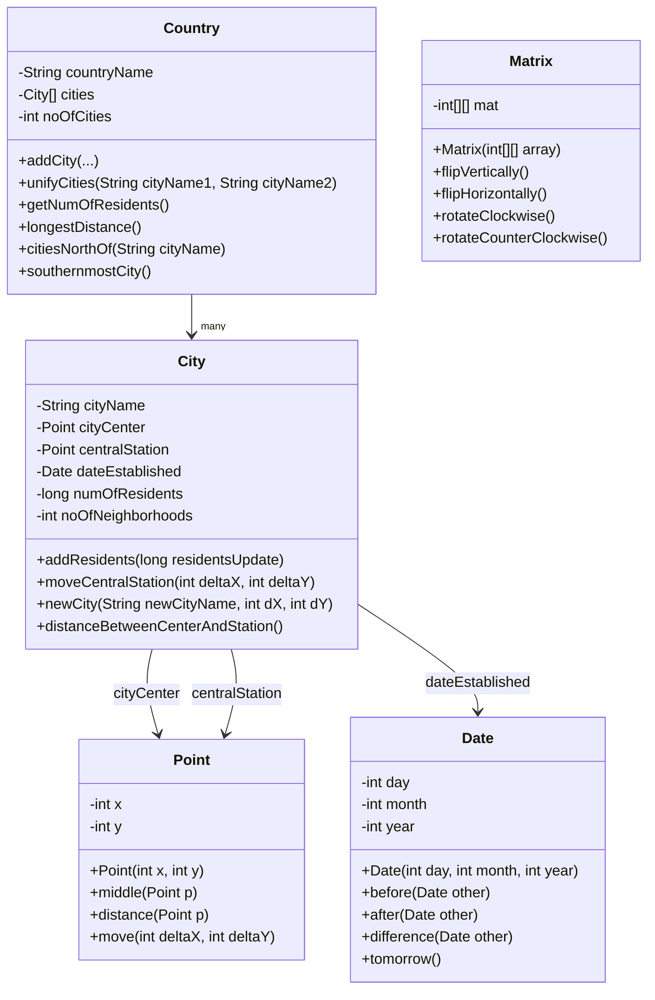
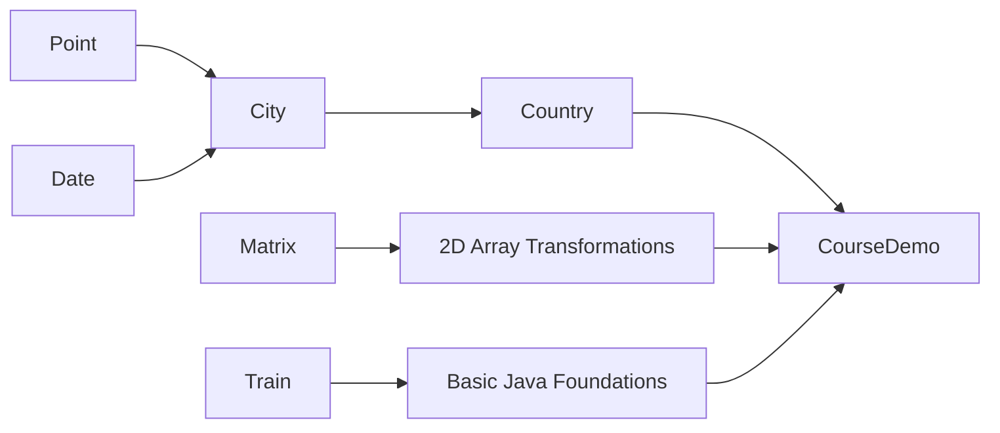

<div align="center">

# Java-A-Intro-20453

### Integrated Java portfolio project for  
### **20453 – Introduction to Computer Science and Java A**

<br>


</div>

---

## Project Overview

This repository presents the main Java classes developed during **course 20453 – Introduction to Computer Science and Java A**.

Instead of keeping each assignment as a separate repository, the code was reorganized into a single integrated project that demonstrates a clear learning path:

- basic Java syntax and arithmetic
- variables and primitive types
- conditionals and methods
- object-oriented programming
- custom class design
- object composition
- arrays of objects
- two-dimensional arrays
- matrix-style transformations
- a small integration demo connecting the main classes

The goal of this repository is not only to store coursework, but to present the progression of learning in a cleaner, more professional structure.

---

## Learning Path

<div align="center">


→

→

→

→


</div>

```text
Train
  ↓
Point
  ↓
Date
  ↓
City = Point + Date + city data
  ↓
Country = array of City objects

Matrix = independent 2D-array practice
```

---

## Concepts Demonstrated

<div align="center">


</div>

---

## Repository Structure

```text
Java-A-Intro-20453/
├── README.md
├── .gitignore
└── src/
    ├── Train.java
    ├── Point.java
    ├── Date.java
    ├── City.java
    ├── Country.java
    ├── Matrix.java
    └── CourseDemo.java
```

---

## Main Classes

| Class | Role | Main Concepts |
|---|---|---|
| `Train` | Introductory Java program | input, arithmetic, basic calculations |
| `Point` | Represents a coordinate | geometry, object state, distance, movement |
| `Date` | Custom date implementation | validation, comparison, date difference |
| `City` | Represents a city | object composition using `Point` and `Date` |
| `Country` | Represents a collection of cities | arrays of objects, aggregation, search logic |
| `Matrix` | Represents a grayscale-style matrix | 2D arrays, flips, rotations |
| `CourseDemo` | Integration demo | demonstrates how the main classes work together |

---

## Architecture



---

## Integration Flow



---

## Demo Highlights

`CourseDemo.java` was added as an integration layer.  
It is not a standalone assignment file; it exists to show how the separate classes can work together as one coherent Java project.

<details>
<summary><strong>Point and Date Demo</strong></summary>

Demonstrates:

- creating `Point` objects
- calculating midpoint
- calculating distance
- creating custom `Date` objects
- calculating date differences

</details>

<details>
<summary><strong>City and Country Demo</strong></summary>

Demonstrates:

- creating a `Country`
- adding multiple `City` objects
- using `Point` and `Date` inside `City`
- calculating total residents
- finding longest distance between city centers
- finding the southernmost city
- finding cities north of another city
- unifying two cities

</details>

<details>
<summary><strong>Matrix Demo</strong></summary>

Demonstrates:

- creating a grayscale-style matrix
- vertical flip
- horizontal flip
- clockwise rotation
- counter-clockwise rotation

</details>

---

## How to Compile and Run

From the repository root:

```bash
mkdir -p out
javac -d out src/*.java
java -cp out CourseDemo
```

Expected behavior:

- the source files compile into `out/`
- `CourseDemo` runs through the main class interactions
- matrix transformations are printed to the terminal

---

## Example Output Snapshot

```text
=== Point and Date Demo ===
Point 1: (2,3)
Point 2: (8,11)
Middle point: (5,7)
Distance: 10.0

=== City and Country Demo ===
Total residents: 445000
Longest distance between cities: 48.877397639399746

=== Matrix Demo ===
Original matrix:
0    50    100
150  200   255
```

---

## Why This Repository Was Reorganized

The original work came from several course assignments.  
However, many of the classes were logically connected:

```text
Point and Date became foundational classes.
City uses Point and Date.
Country manages multiple City objects.
Matrix demonstrates a separate branch of 2D-array practice.
Train represents the early foundation stage of Java programming.
```

For that reason, the repository was restructured from separate assignment folders into a cleaner `src/`-based project.

This makes the code easier to review and better represents the learning process behind the course.

---

## Notes

- This repository focuses on **source code and integration**, not on reproducing original course handouts.
- `CourseDemo.java` was added after the original coursework to demonstrate integration.
- `out/` is used only for compiled files and is ignored by Git.
- The code intentionally keeps the educational structure of the original Java course while presenting it in a cleaner portfolio format.

---

## Author

**Shimon Esterkin**  
Computer Science Student  
Open University of Israel

<div align="center">


</div>
